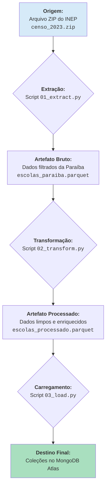

# Governança e Linhagem de Dados - Alpargatas Insight

## 1. Introdução

Este documento serve como a fonte central de verdade para todos os dados utilizados na plataforma Alpargatas Insight. O seu objetivo é garantir a transparência, a confiabilidade e a reprodutibilidade das nossas análises, detalhando a origem, as transformações e as definições de cada conjunto de dados.

Esta é a implementação prática da nossa política de Governança de Dados.

---

## 2. Fontes de Dados Primárias (MVP)

### 2.1. Censo Escolar da Educação Básica

- **Nome da Fonte:** Microdados do Censo Escolar
- **Mantenedor:** Instituto Nacional de Estudos e Pesquisas Educacionais Anísio Teixeira (INEP)
- **Link Oficial de Acesso:** [Portal de Dados Abertos do INEP](https://www.gov.br/inep/pt-br/acesso-a-informacao/dados-abertos/microdados)
- **Versão Utilizada no Projeto:** **2023**
- **Descrição:** Este é o principal levantamento estatístico sobre a educação básica no Brasil. Contém informações detalhadas sobre escolas, turmas, alunos e profissionais da educação em nível municipal, estadual e federal. Os dados são disponibilizados em formato de arquivos CSV, compactados em um arquivo ZIP.

#### **Linhagem dos Dados (Data Lineage)**

O fluxograma abaixo descreve a jornada dos dados desde sua origem bruta até estarem prontos para consumo pela API no banco de dados.

**Etapas Detalhadas:**

1. **Download e Cópia (Manual/Dockerfile):** O arquivo `censo_2023.zip` é baixado manualmente e colocado na pasta `etl/data/`. O `Dockerfile` do ETL copia este arquivo para dentro da imagem Docker, garantindo que o processo seja offline e reprodutível.

2. **Extração (`01_extract.py`):**

   - O script lê o arquivo `.zip` de dentro do container.
   - Ele identifica e descompacta o arquivo `.csv` principal em memória.
   - Os dados são carregados em um DataFrame do Pandas.
   - **Primeira Filtragem:** Apenas os registros do estado da Paraíba (`SG_UF == 'PB'`) e de escolas públicas em funcionamento são selecionados.
   - O resultado é salvo como `escolas_paraiba.parquet`, contendo todas as colunas originais, mas apenas para o universo de interesse.

3. **Transformação (`02_transform.py`):**

   - O script carrega o arquivo `escolas_paraiba.parquet`.
   - **Seleção e Renomeação:** Apenas as colunas relevantes para o projeto são selecionadas e renomeadas para nomes amigáveis (ex: `NO_ENTIDADE` -> `escola_nome`).
   - **Limpeza:** Tipos de dados são corrigidos e valores nulos são tratados.
   - **Estruturação:** Colunas relacionadas são agrupadas em sub-documentos (ex: `infraestrutura`, `indicadores`) para se alinharem ao modelo NoSQL.
   - **Enriquecimento:** A lógica de cálculo do `score_de_risco` é aplicada, criando uma nova coluna com este indicador.
   - O resultado é salvo como `escolas_processado.parquet`.

4. **Carregamento (`03_load.py`):**
   - O script carrega o arquivo `escolas_processado.parquet`.
   - Ele se conecta ao cluster do MongoDB Atlas.
   - Os dados são inseridos (com `update_one` e `upsert=True` para evitar duplicatas) nas coleções designadas (ex: `escolas`).

---

## 3. Fontes de Dados Secundárias (Visão de Futuro)

Para futuras evoluções do projeto, as seguintes fontes de dados foram mapeadas para enriquecer a análise e permitir a funcionalidade de "Análise Ecossistêmica":

- **Fonte:** Censo Demográfico e PNAD Contínua (IBGE)

  - **Uso Potencial:** Cruzar dados educacionais com indicadores socioeconômicos (renda per capita, escolaridade dos pais) por município.

- **Fonte:** Mapa das Organizações da Sociedade Civil (IPEA)

  - **Uso Potencial:** Mapear ONGs e parceiros em potencial que já atuam nos territórios das escolas de alto risco.

- **Fonte:** Dados de Emprego (CAGED/RAIS)
  - **Uso Potencial:** Analisar a correlação entre evasão escolar e a dinâmica do mercado de trabalho local.
