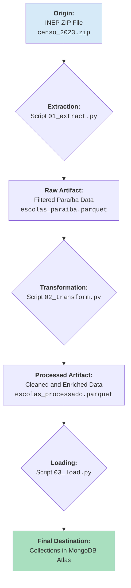

# Data Governance and Lineage - Alpargatas Insight

## 1. Introduction

This document serves as the central source of truth for all data used in the Alpargatas Insight platform. Its purpose is to ensure the transparency, reliability, and reproducibility of our analyses by detailing the origin, transformations, and definitions of each dataset.

This is the practical implementation of our Data Governance policy.

---

## 2. Primary Data Sources (MVP)

### 2.1. Basic Education School Census

- **Source Name:** School Census Microdata
- **Maintainer:** National Institute for Educational Studies and Research Anísio Teixeira (INEP)
- **Official Access Link:** [INEP Open Data Portal](https://www.gov.br/inep/pt-br/acesso-a-informacao/dados-abertos/microdados)
- **Version Used in Project:** **2023**
- **Description:** This is the main statistical survey on basic education in Brazil. It contains detailed information about schools, classes, students, and education professionals at the municipal, state, and federal levels. The data is provided in CSV format, compressed in a ZIP file.

#### **Data Lineage**

The flowchart below describes the data's journey from its raw origin to being ready for consumption by the API in the database.

**Detailed Steps:**

1.  **Download and Copy (Manual/Dockerfile):** The `censo_2023.zip` file is downloaded manually and placed in the `etl/data/` folder. The ETL's `Dockerfile` copies this file into the Docker image, ensuring the process is offline and reproducible.

2.  **Extraction (`01_extract.py`):**

    - The script reads the `.zip` file from within the container.
    - It identifies and unzips the main `.csv` file in memory.
    - The data is loaded into a Pandas DataFrame.
    - **Initial Filtering:** Only records from the state of Paraíba (`SG_UF == 'PB'`) and active public schools are selected.
    - The result is saved as `escolas_paraiba.parquet`, containing all original columns but only for the universe of interest.

3.  **Transformation (`02_transform.py`):**

    - The script loads the `escolas_paraiba.parquet` file.
    - **Selection and Renaming:** Only the columns relevant to the project are selected and renamed to user-friendly names (e.g., `NO_ENTIDADE` -> `escola_nome`).
    - **Cleaning:** Data types are corrected, and null values are handled.
    - **Structuring:** Related columns are grouped into sub-documents (e.g., `infraestrutura`, `indicadores`) to align with the NoSQL model.
    - **Enrichment:** The `risk_score` calculation logic is applied, creating a new column with this indicator.
    - The result is saved as `escolas_processado.parquet`.

4.  **Loading (`03_load.py`):**
    - The script loads the `escolas_processado.parquet` file.
    - It connects to the MongoDB Atlas cluster.
    - The data is inserted (using `update_one` and `upsert=True` to avoid duplicates) into the designated collections (e.g., `escolas`).

---

## 3. Secondary Data Sources (Future Vision)

For future project evolutions, the following data sources have been mapped to enrich the analysis and enable the "Ecosystem Analysis" functionality:

- **Source:** Demographic Census and Continuous PNAD (IBGE)

  - **Potential Use:** Cross-reference educational data with socioeconomic indicators (per capita income, parental education level) by municipality.

- **Source:** Map of Civil Society Organizations (IPEA)

  - **Potential Use:** Map NGOs and potential partners already operating in the territories of high-risk schools.

- **Source:** Employment Data (CAGED/RAIS)
  - **Potential Use:** Analyze the correlation between school dropout rates and local labor market dynamics.
